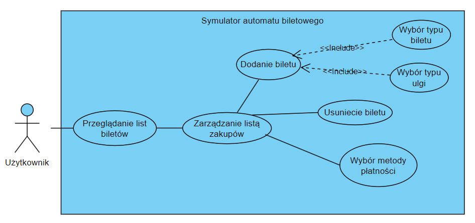

# Ticket Machine Simulator
***
## Etap I

- **Wstępny opis działania programu**

    Symulator automatu biletowego jest aplikacją zaprojektowaną do naśladowania funkcjonalności rzeczywistego automatu 
    biletowego. Symulator oferuje szereg funkcji, odzwierciedlających te dostepne w fizycznych automatach biletowych:
  - wybór rodzaju biletu
  - wybór sterfy biletowej
  - określenie liczby biletów
  - wybór metody płatności
  - generowanie i drukowanie biletu

- **Analiza MoSCoW**
  - Must:
  
    funkcjonalnośći w obrębie zarządzania biletami, responsywność interefejsu użytkownika
  - Should:
  
    dostępność kilku wersji językowych apliakcji, możliwośc dostosowania motywu interfejsu użytkownika 
  - Could:

    interaktywna instrukcja obsługi biletomatu
  - Could:

    możliwość zakupu biletu miesięcznego 

- **Diagram przypadków użycia**
    

- **Wymagania funkcjonalnie i niefunkcjonalne** 
    Wymagania funkcjonalne:
  - Dodawanie biletów do koszyka: Użytkownik może dodawać nowe bilety do koszyka
  - Edytowanie ilości biletów w koszyku: Użytkownik może edytować bilety w swoim koszyku
  - Usuwanie biletów z koszyka: Użytkownik może usuwać bilety z koszyka
  - Przeglądanie dostępnych typów biletu (czasowy, typ ulgi): Użytkownik może wybierać pożądany typ biletu oraz rodzaj ulgi
  - Wybór metody płatności: Użytkownik może wybrać którą z metod płatności chce użyć, aby opłacić należną sumę
      
    Wymagania niefukcjonalne:
  - Wydajność: Aplikacja powinna działać płynnie nawet przy dużej ilości biletów.
  - Interfejs użytkownika: Interfejs powinien być intuicyjny, łatwy w nawigacji i estetyczny
  - Elastyczna płatność: Biletomat powinien obsługiwać różne metody płatności, takie jak karta płatnicza, karta zbliżeniowa, gotówka, płatności zbliżeniowe.
  - Responsywność: Aplikacja powinna reagować bez opóźnień na interakcje użytkownika
 

- **Wybranie systemu kontroli wersji oraz platformy hosting dla niej, utworzenie repozytorium**

    Jako system kontroli wersji wybrano Git, platformą hostingową jest GitHub.
    Projekt został zainicjalizowany na platformie.
    

- **Raport ze stosowania metodologii programowania zwinnego**

    W trakcie realizacji projektu zadania będą realizowane w sprintach. W Jira utworzony został zespół, 
    wydzielone zadania i przydzielone dla każdego członka zespołu.
    

****
