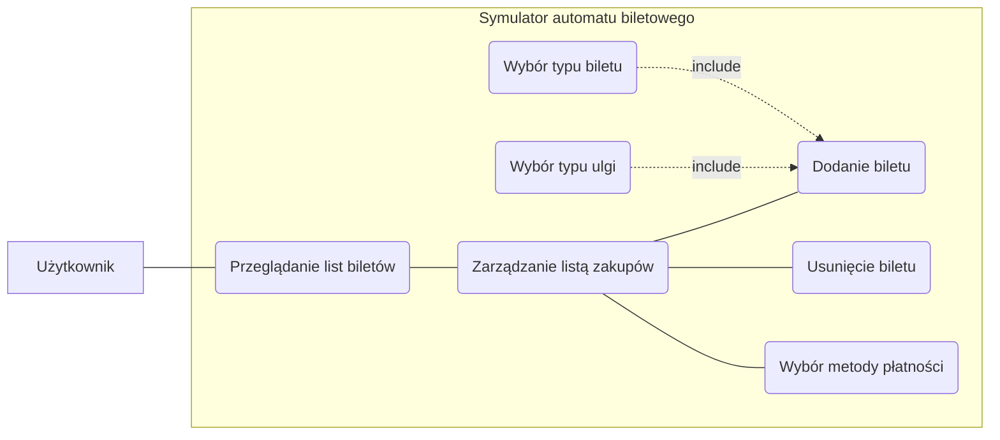

# Ticket Machine Simulator

Etap I

<ul style="font-size:larger;">

<li>
    Wstępny opis działania programu 
    Symulator automatu biletowego jest aplikacją zaprojektowaną do naśladowania funkcjonalności rzeczywistego automatu 
    biletowego. Symulator oferuje szereg funkcji, odzwierciedlających te dostepne w fizycznych automatach biletowych:
    <ul>
        <li>
        wybór rodzaju biletu
        </li>
        <li>
        wybór sterfy biletowej
        </li>
        <li>
        określenie liczby biletów
        </li>
        <li>
        wybór metody płatności
        </li>
        <li>
        generowanie i drukowanie biletu
        </li>
    </ul>

</li>

<li>
    Analiza MoSCoW
    <ul>
        <li>
            Must:  funkcjonalnośći w obrębie zarządzania biletami, responsywność interefejsu użytkownika
        </li>
        <li>
            Should:  dostępność kilku wersji językowych apliakcji, możliwośc dostosowania motywu interfejsu użytkownika 
        </li>
        <li>
            Could:  interaktywna instrukcja obsługi biletomatu
        </li>
        <li>
            Wont:  możliwość zakupu biletu miesięcznego 
        </li>
    </ul>
</li>

<li>
    Diagram przypadków użycia.

</li>

<li>
     Wymagania funkcjonalne i niefunkcjonalne
      
        Wymagania funkcjonalne 
    
<ul>
<li>Dodawanie biletów do koszyka: 
Użytkownik może dodawać nowe bilety do koszyka</li>
<li>Edytowanie ilości biletów w koszyku: 
Użytkownik może edytować bilety w swoim koszyku</li>
<li>Usuwanie biletów z koszyka: 
Użytkownik może usuwać bilety z koszyka</li>
<li>Przeglądanie dostępnych typów biletu (czasowy, typ ulgi): 
Użytkownik może wybierać pożądany typ biletu oraz rodzaj ulgi</li>
<li>Wybór metody płatności: 
Użytkownik może wybrać którą z metod płatności chce użyć, aby opłacić należną sumę</li>

</ul>
 Wymagania niefunkcjonalne
<ul>

<li>Wydajność: 
Aplikacja powinna działać płynnie nawet przy dużej ilości biletów.</li>
<li>Interfejs użytkownika: 
Interfejs powinien być intuicyjny, łatwy w nawigacji i estetyczny.</li>
<li>Elastyczna płatność: 
Biletomat powinien obsługiwać różne metody płatności, takie jak karta płatnicza, karta zbliżeniowa, gotówka, płatności zbliżeniowe.</li>
<li>Responsywność: 
Aplikacja powinna reagować bez opóźnień na interakcje użytkownika</li>

</ul>
</li>

<li>
    
    Wybranie systemu kontroli wersji oraz platformy hosting dla niej, utworzenie repozytorium
    
    
        Jako system kontroli wersji wybrano Git, platformą hostingową jest GitHub.
        Projekt został zainicjalizowany na platformie.
    
    
</li>

<li>
    
    Raport ze stosowania metodologii programowania zwinnego.
      
    
    W trakcie realizacji projektu zadania będą realizowane w sprintach. W Jira utworzony został zespół, 
    wydzielone zadania i przydzielone dla każdego członka zespołu.
    

    
</li>
</ul>

