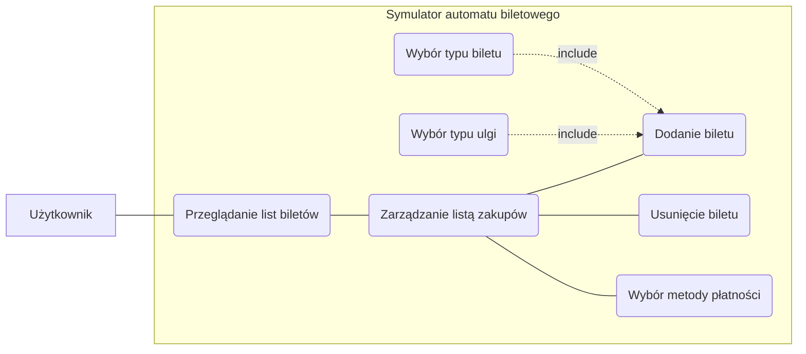
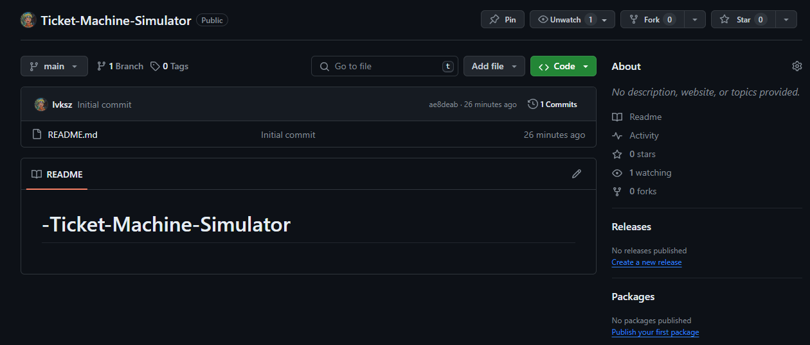
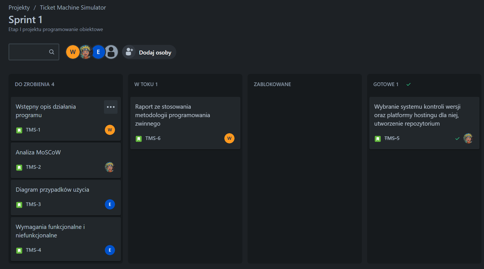
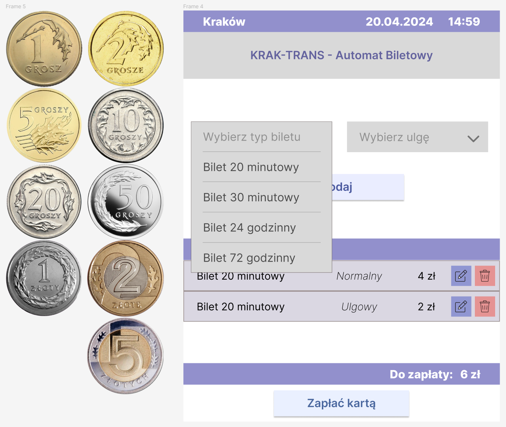
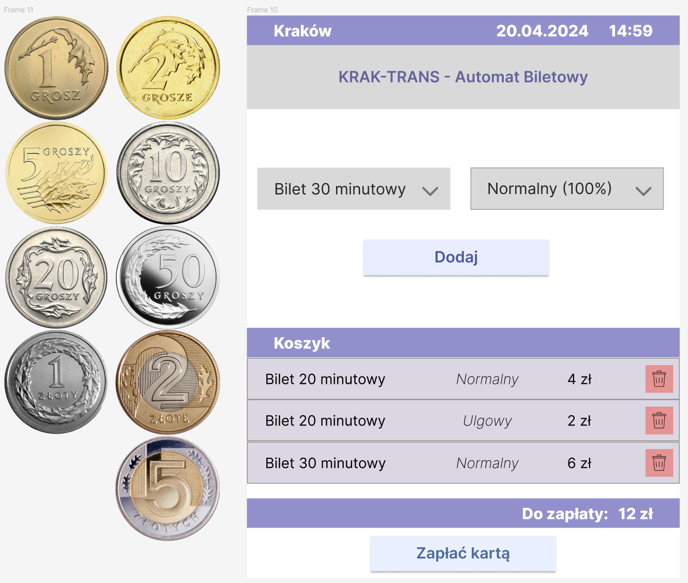

# Ticket Machine Simulator
***
## Etap I

- **Wstępny opis działania programu**

    Symulator automatu biletowego jest aplikacją zaprojektowaną do naśladowania funkcjonalności rzeczywistego automatu 
    biletowego. Symulator oferuje szereg funkcji, odzwierciedlających te dostepne w fizycznych automatach biletowych:
  - wybór rodzaju biletu
  - wybór sterfy biletowej
  - określenie liczby biletów
  - wybór metody płatności
  - generowanie i drukowanie biletu

- **Analiza MoSCoW**
  - Must:
  
    funkcjonalności w obrębie zarządzania biletami, responsywność interefejsu użytkownika
  - Should:
  
    dostępność kilku wersji językowych apliakcji, możliwość dostosowania motywu interfejsu użytkownika 
  - Could:

    interaktywna instrukcja obsługi biletomatu
  - Won't:

    możliwość zakupu biletu miesięcznego 

- **Diagram przypadków użycia** 
        

**Przeglądanie listy biletów:**
 
**Aktor:** Użytkownik 
**Opis:** Użytkownik przegląda dostępne bilety w automacie. 
**Wyzwalacz:** Użytkownik znajduje się na ekranie głównym. 
**Przepływ zdarzeń:** 
1. System wyświetla listę dostępnych biletów. 

**Dodanie biletu:**
 
**Aktor:** Użytkownik 
**Opis:** Użytkownik dokonuje wyboru biletu do zakupu. 
**Wyzwalacz:** Użytkownik znajduje się na ekranie głównym. 
**Przepływ zdarzeń:** 
1. Użytkownik wybiera typ biletu. 
2. Użytkownik wybiera typ ulgi. 
3. Użytkownik potwierdza wybór. 

**Wybór typu biletu:**
 
**Aktor:** Użytkownik 
**Opis:** Użytkownik wybiera typ biletu z listy dostępnych opcji. 
**Wyzwalacz:** Użytkownik znajduje się na ekranie głównym. 
**Przepływ zdarzeń:** 
1. Użytkownik naciska na listę rozwijaną z typami biletów. 
2. Użytkownik wybiera pożądany typ biletu. 

**Wybór typu ulgi:**
 
**Aktor:** Użytkownik 
**Opis:** Użytkownik wybiera rodzaj ulgi, jeśli kupuje bilet ulgowy. 
**Wyzwalacz:** Użytkownik znajduje się na ekranie głównym. 
**Przepływ zdarzeń:** 
1. Użytkownik wybiera opcję wyboru ulgi. 
2. System prezentuje różne dostępne ulgi w formie listy rozwijanej. 
3. Użytkownik wybiera odpowiednią ulgę. 

**Usunięcie biletu:**
 
**Aktor:** Użytkownik 
**Opis:** Użytkownik usuwa wybrany bilet z listy. 
**Wyzwalacz:** Użytkownik znajduje się na ekranie głównym i posiada minimum jeden bilet w koszyku. 
**Przepływ zdarzeń:** 
1. Użytkownik wybiera bilet z listy zakupów. 
2. Użytkownik wybiera opcję usunięcia biletu. 
3. System usuwa bilet z listy. 

**Wybór metody płatności:**
 
**Aktor:** Użytkownik 
**Opis:** Użytkownik wybiera metodę płatności za bilet. 
**Wyzwalacz:** Użytkownik znajduje się na ekranie głównym. 
**Przepływ zdarzeń:**
1. Użytkownik wybiera preferowaną metodę płatności (np. gotówka, karta, płatność mobilna).
2. System przetwarza płatność i wydaje bilet.

**Wymagania funkcjonalnie i niefunkcjonalne** 
    Wymagania funkcjonalne:
  - Dodawanie biletów do koszyka: Użytkownik może dodawać nowe bilety do koszyka
  - Edytowanie ilości biletów w koszyku: Użytkownik może edytować bilety w swoim koszyku
  - Usuwanie biletów z koszyka: Użytkownik może usuwać bilety z koszyka
  - Przeglądanie dostępnych typów biletu (czasowy, typ ulgi): Użytkownik może wybierać pożądany typ biletu oraz rodzaj ulgi
  - Wybór metody płatności: Użytkownik może wybrać którą z metod płatności chce użyć, aby opłacić należną sumę
      
    Wymagania niefukcjonalne:
  - Wydajność: Aplikacja powinna działać płynnie nawet przy dużej ilości biletów.
  - Interfejs użytkownika: Interfejs powinien być intuicyjny, łatwy w nawigacji i estetyczny
  - Elastyczna płatność: Biletomat powinien obsługiwać różne metody płatności, takie jak karta płatnicza, karta zbliżeniowa, gotówka, płatności zbliżeniowe.
  - Responsywność: Aplikacja powinna reagować bez opóźnień na interakcje użytkownika
 

- **Wybranie systemu kontroli wersji oraz platformy hosting dla niej, utworzenie repozytorium**

    Jako system kontroli wersji wybrano Git, platformą hostingową jest GitHub.
    Projekt został zainicjalizowany na platformie.
    

- **Raport ze stosowania metodologii programowania zwinnego**

    W trakcie realizacji projektu zadania będą realizowane w sprintach. W Jira utworzony został zespół, 
    wydzielone zadania i przydzielone dla każdego członka zespołu.
    

****
## Etap 2
- **Przygotowanie koncepcji wizualnej programu**

  
  
  
